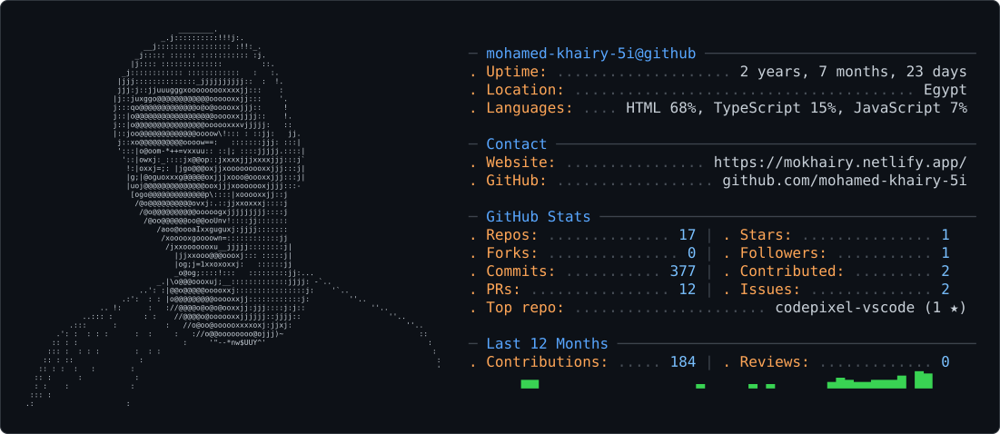

<picture>
  <source media="(prefers-color-scheme: dark)" srcset="dark_mode.svg" />
  <source media="(prefers-color-scheme: light)" srcset="light_mode.svg" />
  
</picture>

  

  

# Mohamed Khairy — محمد خيري

**Freelance Frontend Developer** building Arabic SaaS products for Egypt.
React · TypeScript · AI · Flutter

---

### 🚀 Currently Building — [TossInbox](https://github.com/mohamed-khairy-5i/tossinbox)

> Disposable email inboxes for humans **and** AI agents — spawn a throwaway inbox, wait for the OTP, toss it. No sign-up, no API keys.

---

### 🧰 Tech Stack

  

**Frontend:** React 19 · Next.js 16 · TypeScript · Tailwind CSS · Astro
**Mobile:** Flutter · Dart
**Backend:** Node.js · Python · Supabase · Firebase
**AI:** OpenAI · MediaPipe · ONNX · WebAssembly
**DevOps:** Netlify · Cloudflare · Docker · CI/CD

---

### ⭐ Featured Projects

| Project | Description |
|---------|-------------|
| [**TossInbox**](https://github.com/mohamed-khairy-5i/tossinbox) | Disposable email CLI + MCP server for AI agents |
| [**TrimBG**](https://github.com/mohamed-khairy-5i/TrimBG) | AI background remover — 100% local & private |
| [**codepixel-vscode**](https://github.com/mohamed-khairy-5i/codepixel-vscode) | VS Code extension for beautiful code screenshots |
| [**mind-map**](https://github.com/mohamed-khairy-5i/mind-map) | Interactive mind mapping tool |
| [**Calcuzakat**](https://github.com/mohamed-khairy-5i/Calcuzakat) | Islamic Zakat calculator built with Astro |
| [**naqi-app**](https://github.com/mohamed-khairy-5i/naqi-app) | Permissions management app (Flutter) |
| [**devsignal**](https://github.com/mohamed-khairy-5i/devsignal) | GitHub work → recruiter-ready developer card |
| [**Nexluna**](https://github.com/mohamed-khairy-5i/Nexluna) | Arabic unit converter with blog & SEO |

---

### 📊 GitHub Stats

  

  
  

  
  

  

### 🐍 Contribution Snake

<picture>
  <source media="(prefers-color-scheme: dark)" srcset="https://raw.githubusercontent.com/mohamed-khairy-5i/mohamed-khairy-5i/output/github-snake-dark.svg" />
  <source media="(prefers-color-scheme: light)" srcset="https://raw.githubusercontent.com/mohamed-khairy-5i/mohamed-khairy-5i/output/github-snake.svg" />
  
</picture>

---

### 📫 Get in Touch

---

⏭️ **Next up:** قسطلي — نظام إدارة الأقساط للشركات الصغيرة *(on hold)*
